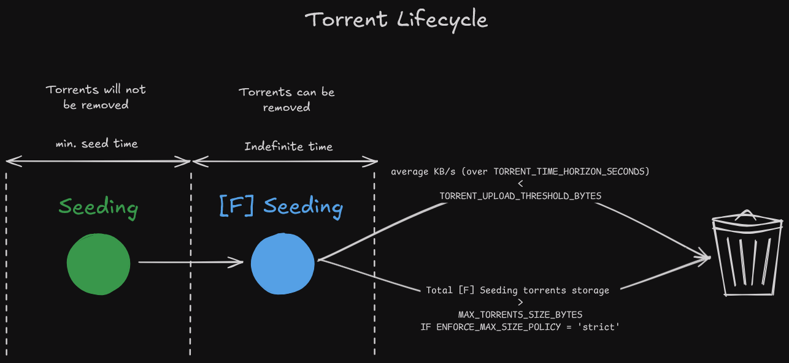

# autobrr-monitor
A docker container to automatically manage torrents added by autobrr to qbittorrent, and monitoring them using prometheus qbittorrent-exporter

## What does it do?
Do you want to maintain a good ratio on a (private) tracker using autobrr, but find it annoying to monitor torrents from autobrr and remove slow ones, and switching autobrr on/off? autobrr-monitor does this for you! You can set some parameters, like the desired average global upload speed over a time horizon in the past (like the past 5 days), and a storage limit, and autobrr-monitor will try to maintain this for you! 

## How does it work?
There are several important paramters to set when you use autobrr-monitor's docker container.

Setup Variables (To connect to qBittorrent, autobrr, and prometheus):
* `QBITTORRENT_HOST`: Set this to your qBittorrent server's IP
* `QBITTORRENT_PORT`: Set this to your qBittorrent's port (usually `8080`)
* `QBITTORRENT_USERNAME`: Self explanatory
* `QBITTORRENT_PASSWORD`: Self explanatory
* `PROMETHEUS_HOST`: Set this to your Prometheus server's IP
* `PROMETHEUS_PORT`: Set this to your Prometheus's port (usually `9090`)
* `AUTOBRR_HOST`: Set this to your autobrr server's IP
* `AUTOBRR_PORT`: Set this to your autobrr's port (usually `7474)
* `AUTOBRR_API_KEY`: Create one in your autobrr web api under `Settings` > `API keys`

Parameters:
* `GLOBAL_UPLOAD_THRESHOLD_BYTES`: The average global upload threshold in bytes. If the average upload speed over `GLOBAL_TIME_HORIZON_SECONDS` doesn't pass this threshold, autobrr will be enabled to add more torrents using any filters you've set.
* `GLOBAL_TIME_HORIZON_SECONDS`: The time horizon to calculate the average global upload speed for.
* `TORRENT_UPLOAD_THRESHOLD_BYTES`: The average upload threshold **per torrent** in bytes. If a torrent (which has no more remaining seed time left) drops below this average over the past `TORRENT_TIME_HORIZON_SECONDS` seconds, then it will be **removed along with its files**.
* `TORRENT_TIME_HORIZON_SECONDS`: The time horizon to calculate the average upload speed per torrent for.
* `MAX_TORRENTS_SIZE_BYTES`: The maximum amount of space you want to dedicate to autobrr torrents. For instance, if you set this to `1099511627776` (1TB in Bytes), then autobrr-monitor will disable autobrr if all your autobrr torrents exceed this amount, so that no more new autobrr torrents get added.
* `ENFORCE_MAX_SIZE_POLICY`: This can be set to `strict` or `relaxed`. `strict` it will remove any "completed" torrents (or Forced Seeded torrents) if your autobrr torrents exceed the MAX_TORRENTS_SIZE_BYTES, even if these torrents satisfy the average upload threshold (`TORRENT_UPLOAD_THRESHOLD_BYTES`). `relaxed` means it will keep these torrents, but autobrr will remaing disabled until more torrents have completed their minimum seed time

Other Variables:
* `TORRENT_CATEGORY_FILTER`: When you connect autobrr to qbittorrent, make sure to set a category like `autobrr` so that all torrents added to qbittorrent will have a category `autobrr`. Then set this variable to the same category, and it will only monitor and remove these torrents, as to not interfere with any other torrents you may have (eg. excluding any Sonarr or Radarr torrents)
* `MONITOR_INTERVAL_MINUTES`: How frequently to run autobrr-monitor. Every minute (`1`) is the minimum.
* `SIMULATION_MODE`: Default is `1`, meaning it wont remove any of your torrents, it will only simulate removal in the logs.
* `DEBUG`: Default is `1`, will output many logs to see internal behaviour of autobrr-monitor.

    `SIMULATION_MODE` and `DEBUG` should be set to `0` once you are happy with your `Parameters` settings. Leave them as `1` while you're still tweaking the settings.
* `AUTOBRR_INDEXER_NAME`: The name of the indexer you want switched on/off by autobrr-monitor. This can bee seen in autobrr web ui in `Settings` > `Indexers`

Diagram:

## Requirements
* qbittorrent-exporter by @caseyscarborough: https://hub.docker.com/r/caseyscarborough/qbittorrent-exporter
    * See github repo for instructions: https://github.com/caseyscarborough/qbittorrent-exporter
    * Optional: Setup a grafana dashboard
        * https://github.com/caseyscarborough/qbittorrent-grafana-dashboard
        * Grafana docker image required: https://hub.docker.com/r/grafana/grafana
* prometheus: https://hub.docker.com/r/prom/prometheus/

qBittorrent's Web API doesn't provide historical upload/download data. qbittorrent-exporter collects data about your qbittorrent instance, such as upload/download globally and on a torrent level. Prometheus is a service monitoring system, which you can configure to connect to qbittorrent-exporter, so that you can query historical qBittorrent data, collected by qbittorrent-exporter, using prometheus. Grafana is optional, and allows you to create a dashboard that allows you to view all of the information from qbittorrent-exporter.
